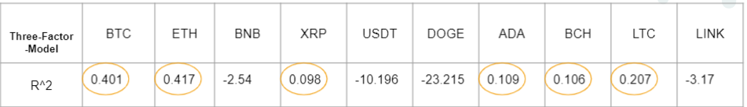
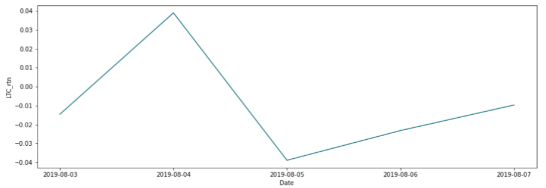
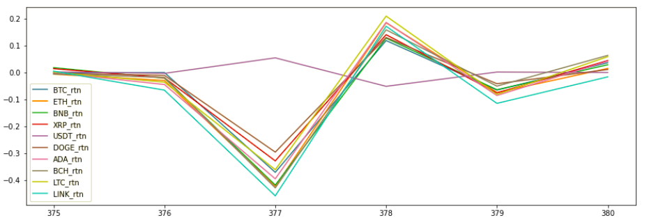
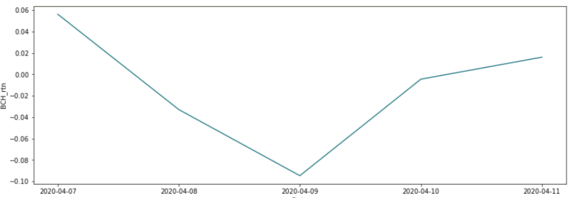

## FINAL REPORT 
### by Chuyu Chen, Shujin Gong, Jiaming Yao, Ziyi Zhuang

_Prof note: The powerpoint is [here in google slides](https://docs.google.com/presentation/d/11Eu9d1ZgZgUZY8FuNSJFeEhf7E4v7GLwo-1SAaLJzCk/edit#slide=id.p) and [here as a pdf]("FIN 377 Final Presentation.pdf")_

### Guideline of this repo

- `collect_raw_data.ipynb`: download all necessary data we need 
- `Part 1-Market_Crypto_Regression.ipynb`: explore the relationship between return of crypto and stock market. 
- `Part 2-Three Factor Model.ipynb`: explore the relationship between return of crypto and three factors model. 
- `Part 3 - ploting.ipynb`: explore the relationship between return of crypto and publice events and news.

### Summary  

In this repository, our main goal is to find what factors drive the return of cryptocurrency? We have three specific research questions. The first is if the stock market drives the returns of cryptocurrency? The second is if the simplified three-factor model explains the returns of cryptocurrency? The last question is if the public news or events drive the returns of cryptocurrency? To answer the first question, based on the results from  ‘Part 1- Market_Crypto_Regression.ipynb’, we think the returns of cryptocurrency have a non-significant relationship with stock market returns, because of extremely low coefficients and R^2 values. For the second question, refer to ‘Part 2 - Three-Factor-model.ipynb’, we think the simplified three-factor model could explain the price change of cryptocurrency to some extent. And the R^2 values and coefficients of the simplified three-factor model would be better than our part 1 model. Refer to ‘Part3_plotting.ipynb’, we conclude that social events affect the price and return of the cryptocurrency, and continuous and powerful social events could increase the volatility of daily price and daily return significantly.

### Why interesting 

Cryptocurrency is a form of payment that can be exchanged online for goods and services(James Royal, 2021). Nowadays, more and more people would invest a huge amount of money in cryptocurrencies. There are a variety of reasons why cryptocurrency has become so popular. For instance, some people think the technology behind cryptocurrency, the blockchain, could be more secure and safe than traditional payment systems(James Royal, 2021). And some people believe cryptocurrencies could become the currency of the future, so people want to buy more cryptocurrencies as they become more valuable(James Royal, 2021). However, as a whole new world in economies and the financial industry, Cryptocurrency lacks fundamental analysis. Also, we think Cryptocurrency prices are extremely volatile. So, in this repository, our group aims to find what factors drive the price of the cryptocurrency. 

### Approach 

To better answer the research questions, our group split the analysis process into three main parts. In the first part, refer to ‘Part 1- Market_Crypto_Regression.ipynb’, we download the return information of SP500 and DJ30 as well as the price information of Top 10 market cap cryptocurrencies on Coinbase. After merging these two datasets, we split the dataset into training and testing by a 7:3 ratio. Finally, we run the regression analysis and visualizations to explore the correlation between stock returns and the price of each Top 10 cryptocurrency. 

In the second part, refer to ‘ Part 2 - Three-Factor-model. ipynb’, based on the Fama-French three-factors-model and cryptocurrency’s three-factors-model from the research study Asset Pricing Analysis of 18 Cryptocurrencies(Pontoh & Rizkianto, 2020), we create the simplified three-factor-model. Then, we download the daily adjusted close price and volume information of each Top 10 Cryptocurrency as well as the risk-free rate. After merging these datasets, we split the dataset in training and testing by 75%:25% ratio. Finally, we run the regression analysis to explore the correlation between simplified three-factor-model and returns of each Top 10 cryptocurrency. While we do regression for each Top 10, we do Machine Learning at the same time. The model we used in Machine Learning is the linear regression which is used for regression. Then, we use this model to predict the return of cryptocurrency and compare it with the true return.

For the third part analysis, refer to ‘Part3_plotting.ipynb’, we select several important public events that might relate to daily price and daily return changes of cryptocurrencies (2019-03-13 to 2021-04-30). And we use the visualizations to find the relationship between public events and the price change of cryptocurrencies. 

### Data 

### Part 1 
Our main data sources are Yahoo Finance. To acquire market index return, we first set up the start time and end time and use the .get_data_yahoo to load data. Then, we use the .pct_change() to calculate return and save this dataset as ‘input_data\market_index_return.csv’. To acquire return information of cryptocurrencies, we start to create a list with TOP 10 company names. After setting up the start time and end time, we use the .get_data_yahoo to load data and use the .pct_change() to calculate return. Then, we save this dataset as ‘input_data\crypto_return.csv’. 

### Part 2
The following CSV files are utilized: ‘cci30_OHLCV.csv’, ‘risk_free_rate.csv’, ‘market_crypto_return.csv’, and ‘cryptos_volume.csv’. In the ‘cci30_OHLCV.csv’, it contains the market price of all of the cryptocurrency. In the ‘risk_free_rate.csv’, it contains all kinds of treasury bonds. In the ‘market_crypto_return’, it contains the daily price and daily return of Top 10 cryptocurrency, which is our object of research. In ‘cryptos_volume.csv’, it contains the daily adj close and volume of Top 10 cryptocurrencies.

We use these files to calculate our three factors: market_premi, crypto dollar volume, and lmh. The market_premi = daily ret - 1 mo treasury bond. The crypto dollar volume = each cryptocurrency's daily adj close * daily volume. The lmh = daily lowest return among Top 10 cryptocurrencies - daily highest return among Top 10 cryptocurrency.

In Part 2, we pick the columns in four csv files that we need to use for calculation, for example: the 'ret' in cci30_OHLCV.csv, the 'Date' and '1 mo' in risk_free_rate, the 'sp500_rtn' and 'DJ30_rtn' in market_crypto_return.csv. Then, we merge those data together for further calculation and save them into one variable called 'three_factor_model'.

### Analysis

Referring to outputs from ‘Part 1-Market_Crypto_Regression.ipynb’, our conclusion is that stock returns of both SP500 and DJ30 don’t exhibit significant relationship between price of cryptocurrency. Based on the regression analysis of the training dataset, we found out that they have really low adjusted R2 value in both SP500 and DJ30. Based on the testing results of cryptos & SP500, there are 6 negative R2 values, and it means that these 6 models fit our data badly. The highest R2 value is 0.023 (BCH), which is still a really low R2 value.  Based on the testing results of cryptos & DJ30, there are 7 negative R2 values, and it means that these 7 models fit our data badly. The highest R2 value is 0.015 (LINK), which is still a really low R2 value. Therefore, in part 1, we conclude that the price of cryptocurrencies have a non-significant relationship with stock returns.

Referring to the outputs from ‘Part 2 - Three-Factor-model.ipynb’, the R^2 values indicate the significant difference between the training and testing returns. There are 6 positive R2 values, with the highest positive value of 0.417, for ETH, the Ethereum cryptocurrency, which demonstrates the partial compliance. And there are 4 negative R2 values, with the lowest value of -23.215, for Doge cryptocurrency. In this case, R^2 value reaches a significantly negative value, and it indicates an abnormal situation that we have not met before, because usually R^2 is between 0 and 1. Since we split the datasets based on the chronological order, the testing period is the past 5 months. The possible reasons might be the increasing focus on doge cryptocurrency and the public events like Elon musk’s manipulation of price in twitter. Therefore, the testing results cannot comply with the actual returns due to the significant differences of crypto features in training and testing period. In addition, according to the three factor model training results, the Beta, correlation between market premium return and return of each cryptocurrency, reflects somewhat positive relationships but significant values to give a strong relationship. 

There are four social events that we chose in part 3. We visualized the changes of daily return by using Seaborn and Plotly.

- Event 1: Litecoins Halving Event (2019-08-05)

On that day, the Litecoin halved:  when the mining reward was reduced from 25 Litecoins per block to 12.5 Litecoins per block. As the graph shows, the daily return of LTC on August 25th decreased to roughly negative 0.04. 

- Event 2: CoronaVirus Outbreak and Travel Ban (2020-03-12)

In the graph, 377 in the x-axis represents 2021-03-12. It is obvious that 9 of our selected cryptocurrencies had decreased 0.4% from the previous date. But on the next day, they rebounded to roughly 0.1%.

- Event 3: Bitcoin Halving Event (2020-04-08)

On that day, the Bitcoin halved:  when the mining reward was reduced from 12.5 Bitcoins per block to 6.25 Bitcoins per block. As the graph shows, however, the daily return of BTC is not the lowest of the selected period

- Event 4: Elon Musk’ Tweets (2021-01-01 to 2021-04-30)

(This is an animation graph so it must be view in Jupyter lab)

Elon Musk has continuously mentioned DogeCoin in the beginning of 2021. The animation shows the daily price change of DogeCoin from less than 0.05 dollar to 0.4 dollar in this period. And the daily return varied from negative 0.22 to 1.

We collected dates that Elon Musk mentioned about Doge on Twitter: 2021-02-04, 2021-02-06, 2021-02-08, 2021-02-10, 2021-02-15, 2021-02-22, 2021-02-24, 2021-03-02, 2021-03-06, 2021-03-14, 2021-04-15.

And we queried the dates when the percent change of daily return and daily price are both greater than 20%: 2021-02-04, 2021-02-06, 2021-04-14, 2021-04-15, 2021-04-18. 

By comparing dates of significant changes and Elon Musk's tweets, there are some duplicates that indicate Elon Musk's tweets influenced DogeCoin.
Based on the analysis from part 3, we think social events do affect the price and return of cryptocurrency since the Internet is one of the most popular information sources for cryptocurrency. The influence on the daily price and return caused by single or one-time events is less than as we expected. Continuous and Powerful social events (Elon Musk’s tweets) could increase the volatility of daily price and daily return.

## Limitations 

Before concluding, we found out there are several limitations that would impact our analysis and conclusion. First, 2020 is not a normal year for the stock market and many industries. For example, sectors like Industrials and Oil & Gas Products/Services seemed to stagnate, while information technology and biotechnology boosted. Thus, the stock market might be influenced by some factors that usually would not. Second, we select the top 10 cryptocurrencies on 04/31/2020 based on the market capitalization. The issues are these top 10 cryptocurrencies are not top 10 in the previous months. This rank would keep changing going forward, so the ranking selected might not present the updated top 10 cryptocurrencies. Also, only 10 cryptocurrencies might not perfectly represent the whole cryptocurrency market. The last limitation is we split the training and testing based on date. Specifically, the period of the training dataset is from 03/01/2019 to 09/25/2021 and the period of the testing dataset is from 09/26/2020 to 04/30/2021. The issue is the testing dataset may not perfectly exhibit the relationship between simplified three-factor-model and returns of cryptocurrencies, because the cryptocurrency market is very volatile. For example, DOGE has different features during the testing period. In addition, the rank of top 10 market cap cryptocurrencies is changing throughout the dynamic trading volumes, so that it might not be representative. The top 10 selected comes from the present, so that it is biased to analyze the returns in the past (2)

## Conclusions 

All in all, based on the previous detailed analysis, the return of cryptocurrency has a non-significant relationship with the stock market (SP500 and DJ30). Second, the simplified three-factor-model could explain the return of some TOP 10 cryptocurrencies. So, the relationship between the return of each TOP 10 cryptocurrency and the simplified three-factor-model varies independently. The last conclusion is the return of cryptocurrency would be impacted by the public events. 

## References 

- James Royal, P. D. (2021, April 22). What Is Cryptocurrency? Beginners Guide to Digital Cash. NerdWallet. https://www.nerdwallet.com/article/investing/cryptocurrency-7-things-to-know#1.-what-is-cryptocurrency.

- Pontoh, S. C., & Rizkianto, E. (2020). Asset Pricing Analysis of 18 Cryptocurrencies. Proceedings of the 23rd Asian Forum of Business Education(AFBE 2019). https://doi.org/10.2991/aebmr.k.200606.048 

